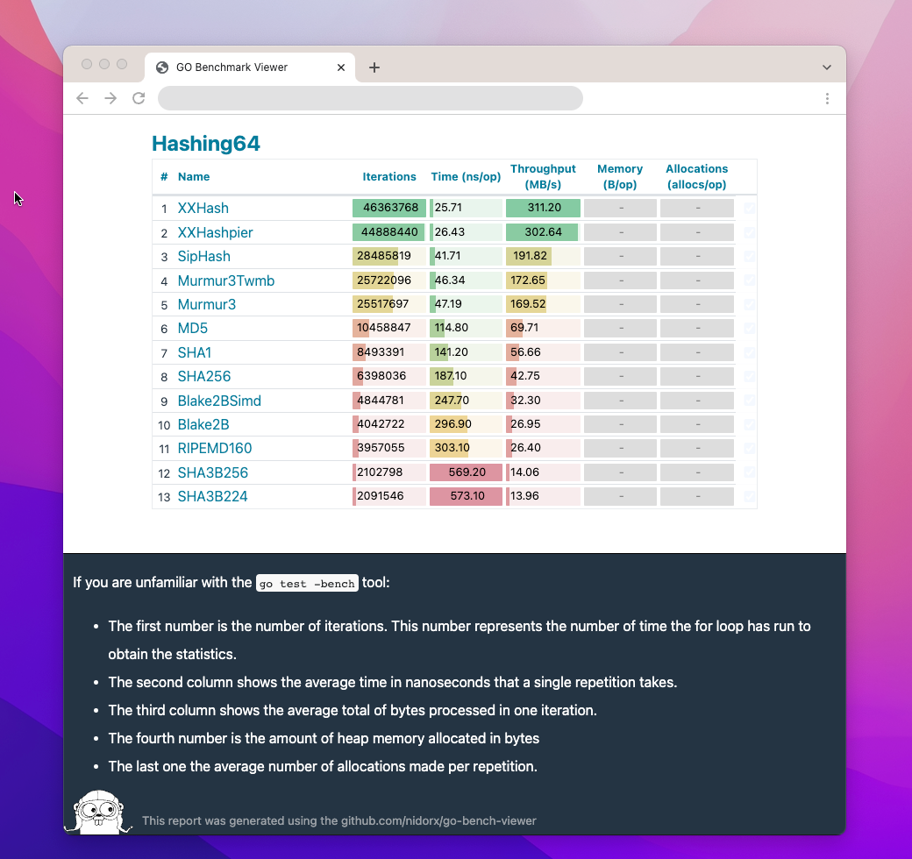

# go-bench-viewer

Easy and intuitive Go Benchmark Results Viewer.

The **go-bench-viewer** is a viewer
of [benchmark results](https://go.googlesource.com/proposal/+/master/design/14313-benchmark-format.md)  generated by
Golang.

It's just a simple `.html` file that does the correct processing and display of the report.

## Features

- Facilitates comparison of results
- Allows you to hide items, making it easier to analyze the results
- Allows custom grouping, via Regular Expression
- No need to install anything, just go to <https://nidorx.github.io/go-bench-viewer>

## Instructions

1.  **to** <https://nidorx.github.io/go-bench-viewer>
2. Click on some things
3. Scroll to bottom of page
                
